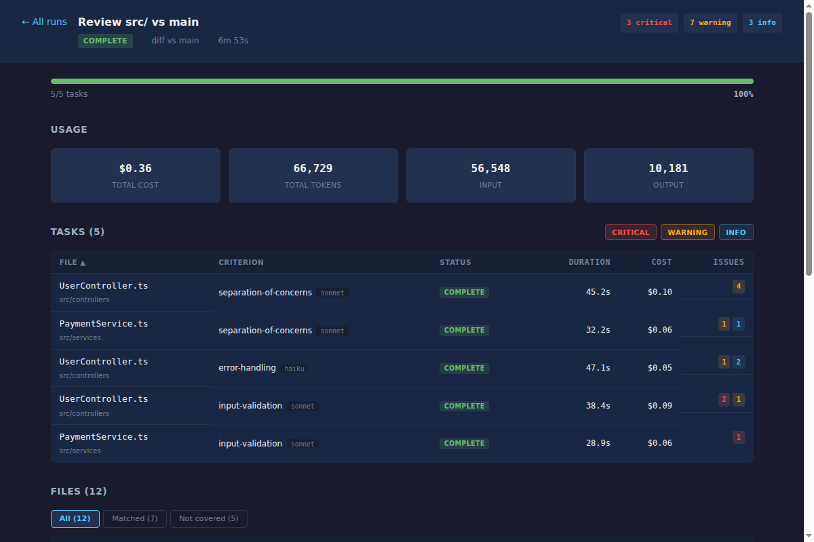
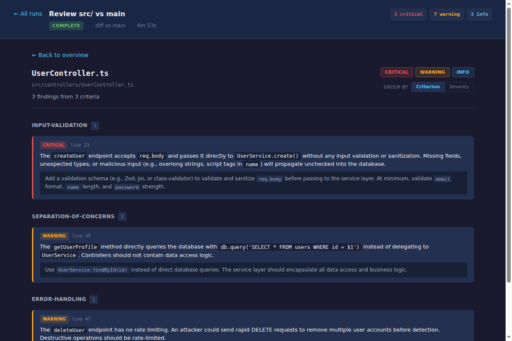

# deskcheck

Modular code review powered by Claude. Define what to check as markdown, deskcheck runs each check in a fresh AI agent, and aggregates the findings.



## Why deskcheck?

Traditional code review tools leave a gap:

- **Tests** verify behavior — they can't tell you "this controller has business logic that belongs in a service"
- **Linters** verify syntax — they can't tell you "this endpoint is missing input validation"
- **A single LLM** reviewing a whole branch suffers **context rot** — as its context fills up, it starts missing the patterns it's supposed to catch

Deskcheck solves this by breaking every review into the smallest possible unit: **one file + one criterion + one fresh agent**. Each agent gets a clean context with only the code it needs and the specific rules to check. Results are aggregated mechanically.

```
Your code + Criteria → N executor agents → Aggregated findings
                        (fresh context each)
```

## Quick Start

```bash
# Install
npm install -g @prowi/deskcheck

# Initialize in your project (creates criteria directory + config)
deskcheck init

# Review your branch changes against main
deskcheck diff main

# Review a specific file
deskcheck "src/services/PaymentService.ts"

# Open the web dashboard
deskcheck serve
```

## How It Works

### 1. You define criteria as markdown

Each criterion is a markdown file with YAML frontmatter that says **what to check**, **which files to check**, and **how important it is**:

```yaml
---
description: "Checks for common security vulnerabilities"
severity: critical
globs:
  - "src/**/*.ts"
  - "!src/**/*.test.ts"
model: sonnet
---

You are a security reviewer. Check for:

1. **Hardcoded secrets** — API keys, passwords, tokens in source code
2. **SQL injection** — string concatenation in database queries
3. **Missing input validation** — user input used without sanitization

For each issue, report the severity, file, line number, and a fix suggestion.
```

Put criteria in `deskcheck/criteria/` — organize them however you like:

```
deskcheck/criteria/
├── security/
│   └── input-validation.md
├── architecture/
│   └── separation-of-concerns.md
└── best-practices/
    └── error-handling.md
```

### 2. Deskcheck matches criteria to your files

Each criterion has `globs` that define which files it applies to. When you run `deskcheck diff main`, it gets the list of changed files and matches them against every criterion's globs. Each match becomes a **task**: one file + one criterion.

### 3. Each task runs in a fresh agent

Every task is executed by a new Claude agent with only:
- The file content (or diff)
- The criterion's instructions
- Access to read tools (Read, Glob, Grep) for additional context

No context leakage between tasks. A fresh agent reviewing one file against one set of rules catches issues with near-100% reliability.

### 4. Findings are aggregated

Results are grouped by file, criterion, and severity. You can browse them in the terminal, as markdown (for PR comments), as JSON (for tooling), or in the **web dashboard**:



## CLI Commands

### `deskcheck diff [git-args...]`

Deterministic review of git changes. No LLM planner — passes args directly to `git diff`.

```bash
deskcheck diff main                       # Changes vs main
deskcheck diff --staged                   # Staged changes only
deskcheck diff HEAD~3                     # Last 3 commits
deskcheck diff main -- src/services/      # Scoped to a directory
deskcheck diff main --dry-run             # Preview plan without executing
deskcheck diff main --fail-on=critical    # Exit 1 if critical findings (for CI)
deskcheck diff main --format=markdown     # Markdown output (for PR comments)
```

### `deskcheck "<prompt>"`

Natural language review — an LLM agent interprets what you want to check.

```bash
deskcheck "src/services/OrderService.ts"
deskcheck "check the auth module"
deskcheck "the calculate method in Commission.ts"
```

### `deskcheck serve`

Web dashboard with live updates. Shows all runs, task progress, usage/cost tracking, and findings with filtering.

```bash
deskcheck serve              # Start on default port (3000)
deskcheck serve --port 8080  # Custom port
```

### `deskcheck show [plan-id]`

Display results in the terminal.

```bash
deskcheck show                        # Latest run
deskcheck show --format=markdown      # As markdown
deskcheck show --format=json          # As JSON
deskcheck show --fail-on=warning      # Exit 1 if warnings or worse
```

### `deskcheck watch [plan-id]`

Live terminal tree view of a run in progress.

### `deskcheck list`

List all runs with status and finding counts.

### `deskcheck init`

Scaffold config and criteria directory for a new project.

## Web Dashboard

Start with `deskcheck serve` and open `http://localhost:3000`.

**Run overview** — progress bar, usage/cost tracking, sortable task table with severity filters, and file coverage:


**File detail** — click any file to see all findings across criteria, with severity filtering and grouping options:


The dashboard uses SSE for live updates — watch tasks complete in real time during execution.

## Criterion Reference

### Frontmatter Fields

| Field | Required | Default | Description |
|-------|----------|---------|-------------|
| `description` | Yes | — | Human-readable description shown in reports |
| `severity` | Yes | — | Importance: `critical`, `high`, `medium`, `low` |
| `globs` | Yes | — | File patterns to match. Prefix with `!` to exclude |
| `mode` | No | `"One task per file"` | How to split files into tasks (natural language) |
| `model` | No | `"haiku"` | Claude model: `haiku`, `sonnet`, `opus` |

### Choosing the Right Model

| Use Case | Model | Why |
|----------|-------|-----|
| Simple patterns (naming, imports, console.log) | `haiku` | Fast and cheap |
| Architectural judgment (separation of concerns, DTOs) | `sonnet` | Good reasoning at moderate cost |
| Security analysis, complex data flow | `opus` | Deep analysis for high-stakes checks |

### The Detective Prompt

The markdown body below the frontmatter is the **detective prompt** — instructions given to each executor agent. Include:

- **What to check** — specific patterns and violations
- **What NOT to check** — exclusions to reduce false positives
- **Severity guidance** — when to report critical vs warning vs info

The agent has read access to the project, so your prompt can reference other files:

```markdown
Read `.eslintrc.js` to understand the project's linting config.
Then check for architectural patterns that ESLint can't catch.
```

## Configuration

Configuration lives in `.deskcheck/config.json` (created by `deskcheck init`):

```json
{
  "modules_dir": "deskcheck/criteria",
  "storage_dir": ".deskcheck/runs",
  "shared": {
    "allowed_tools": ["Read", "Glob", "Grep"],
    "mcp_servers": {}
  },
  "agents": {
    "planner": { "model": "haiku" },
    "executor": {},
    "evaluator": { "model": "haiku" }
  }
}
```

The executor **model** comes from each criterion's `model` field, not from config. This lets cheap checks use `haiku` and important checks use `sonnet`.

## CI Integration

Use `--fail-on` to gate your pipeline:

```bash
# Fail if any critical findings
deskcheck diff $BASE_BRANCH --fail-on=critical

# Output as markdown for PR comments
deskcheck diff $BASE_BRANCH --format=markdown > review.md
gh pr comment $PR_NUMBER --body "$(cat review.md)"
```

Exit codes: `0` = no findings matching threshold, `1` = findings exceed threshold.

## MCP Server

Deskcheck can run as an MCP server for Claude Code integration:

```json
{
  "mcpServers": {
    "deskcheck": {
      "command": "npx",
      "args": ["deskcheck-mcp"]
    }
  }
}
```

## Usage Tracking

Every run tracks token usage and cost per task. The web dashboard shows totals (cost, input/output tokens) and per-task breakdowns, so you can see exactly how much each review costs and which criteria are most expensive.

## Development

The fastest way to get started is with the included **Dev Container** (VS Code + Docker):

1. Open the repo in VS Code
2. When prompted, click **"Reopen in Container"** (or run `Dev Containers: Reopen in Container` from the command palette)
3. Press **Ctrl+Shift+B** to launch the dev environment

This starts three processes in a single terminal group:
- **Backend server** on port 3000 (builds TypeScript, then runs `deskcheck serve`)
- **TypeScript watch** (`tsc --watch` for backend changes)
- **Vite dev server** on port 5173 (Vue UI with hot reload)

Open `http://localhost:5173` for UI development — API requests are proxied to the backend automatically.

### Without Dev Container

```bash
# Terminal 1: backend
npm run build && node build/cli.js serve

# Terminal 2: TypeScript watch
npm run dev

# Terminal 3: UI with hot reload
cd ui && npm install && npm run dev
```

## Disclaimer

This tool was vibe-coded in a single day using [Claude Code](https://claude.ai/claude-code). The architecture, implementation, web UI, and even this README were built through conversation with Claude Opus 4.6. It works, we use it, but it hasn't been battle-tested at scale. Expect rough edges. Contributions welcome.

## License

MIT
